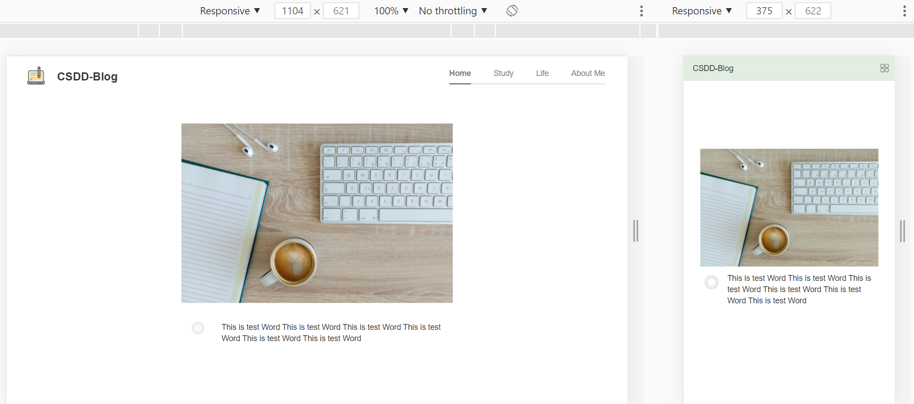
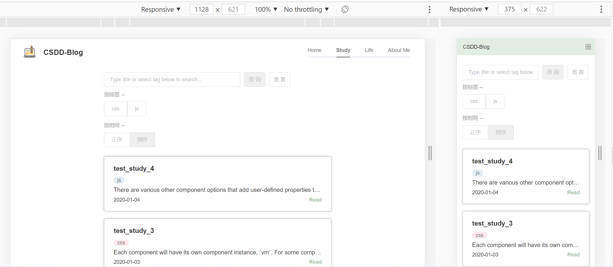
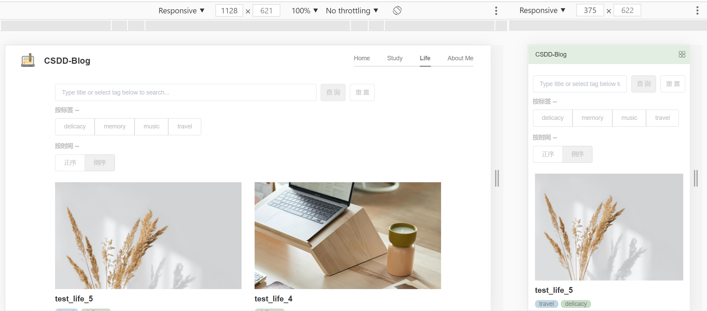
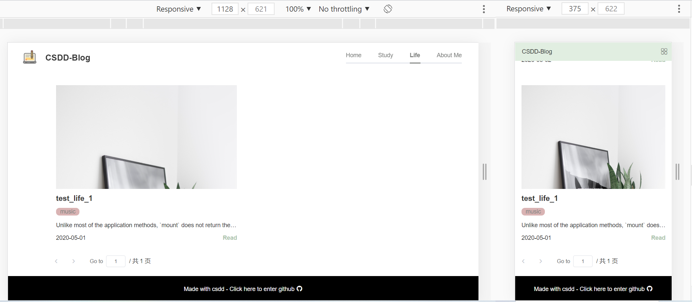
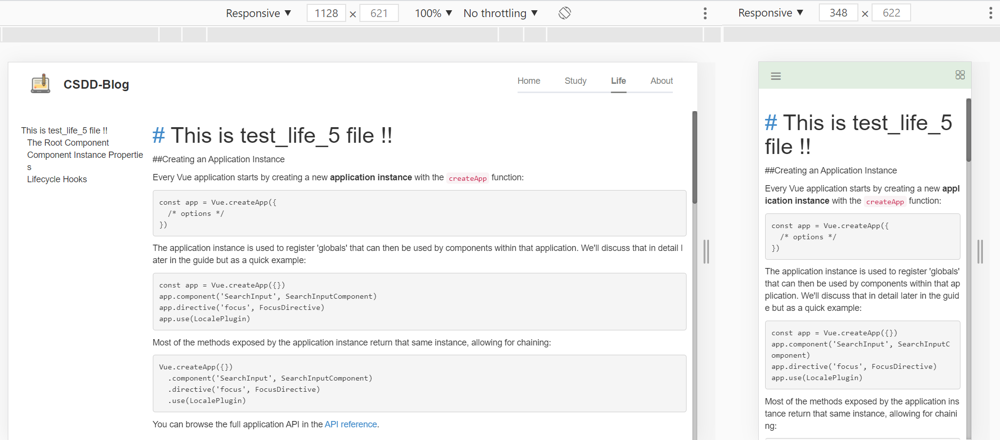
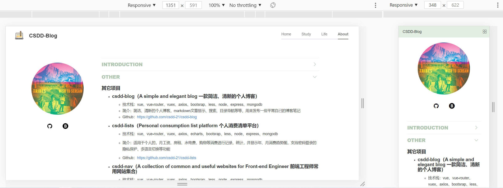

# csdd-blog

**A simple and elegant blog 一款简洁、清新的个人博客**

## 写在最前

博客目前只开发了前端展示界面，博客后台管理系统还待开发中~

预览点这：http://39.108.224.26:1000/ 如果服务器挂了，可以看下面的页面截图（页面截图的所有文件在README.assets 文件夹里）

## 快速启动

```
# csdd-blog根路径
npm i 
npm run serve
# server文件夹（记得先启用mongodb）
nodemon index.js
```

## 前端技术栈

- vue3
- vue-router
- vuex
- axios
- element-plus
- bootstrap
- markdown-it
- less

## 后端技术栈

- node
- express
- mongodb

## 目录结构说明

```
.
├─ README.assets                        项目演示图片资源
│    ├─ 1.png
│    ├─ 2.png
│    ├─ 3.png
│    ├─ 4.png
│    ├─ 5.png
│    └─ 6.png
├─ README.md
├─ package.json                         配置、依赖管理
├─ public
│    ├─ life                            博客Life页面文章
│    │    ├─ test_life_1.jpg
│    │    ├─ test_life_1.md
│    │    ├─ test_life_2.jpg
│    │    ├─ test_life_2.md
│    │    ├─ test_life_3.jpg
│    │    ├─ test_life_3.md
│    │    ├─ test_life_4.jpg
│    │    ├─ test_life_4.md
│    │    ├─ test_life_5.jpg
│    │    └─ test_life_5.md
│    └─ study                           博客Study页面文章
│           ├─ test_study_1.md
│           ├─ test_study_2.md
│           ├─ test_study_3.md
│           └─ test_study_4.md
├─ server
│    ├─ api.js                          服务器请求接口封装
│    ├─ db.js                           mongodb数据库封装
│    └─ index.js                        服务器入口文件
├─ src
│    ├─ App.vue
│    ├─ assets
│    │    ├─ allCss                     views、components文件夹下的各个vue单文件对应的less样式
│    │    │    ├─ About.less
│    │    │    ├─ App.less
│    │    │    ├─ Article.less
│    │    │    ├─ FilterCond.less
│    │    │    ├─ Home.less
│    │    │    ├─ Life.less
│    │    │    ├─ NotFound.less
│    │    │    ├─ Study.less
│    │    │    └─ Tags.less
│    │    ├─ blog.png
│    │    ├─ home.jpg
│    │    └─ iconfont
│    │           └─ ...
│    ├─ components
│    │    ├─ Article.vue
│    │    ├─ FilterCond.vue
│    │    ├─ NotFound.vue
│    │    └─ Tags.vue
│    ├─ main.js
│    ├─ router
│    │    └─ index.js
│    ├─ store
│    │    ├─ actions.js
│    │    ├─ getters.js
│    │    ├─ index.js
│    │    └─ mutations.js
│    └─ views                           页面文件夹
│           ├─ About.vue
│           ├─ Home.vue
│           ├─ Life.vue
│           ├─ Study.vue
│           └─ Test.vue
└─ vue.config.js
```

## 页面截图

- **pc端、移动端首页**



- **pc端、移动端Study页**



- **pc端、移动端Life页**





- **pc端、移动端文章页**



- **pc端、移动端About页**



## 后续功能

目前暂时是挂载github page的，后续可能会部署到云服务器上去吧~

